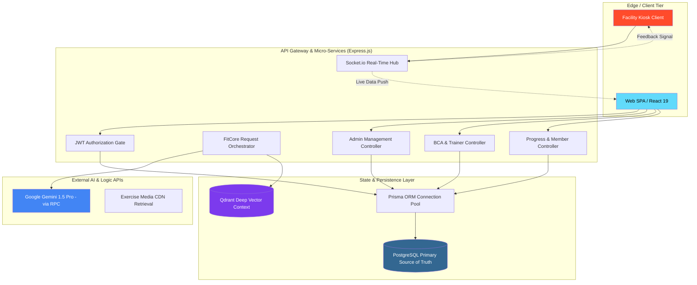
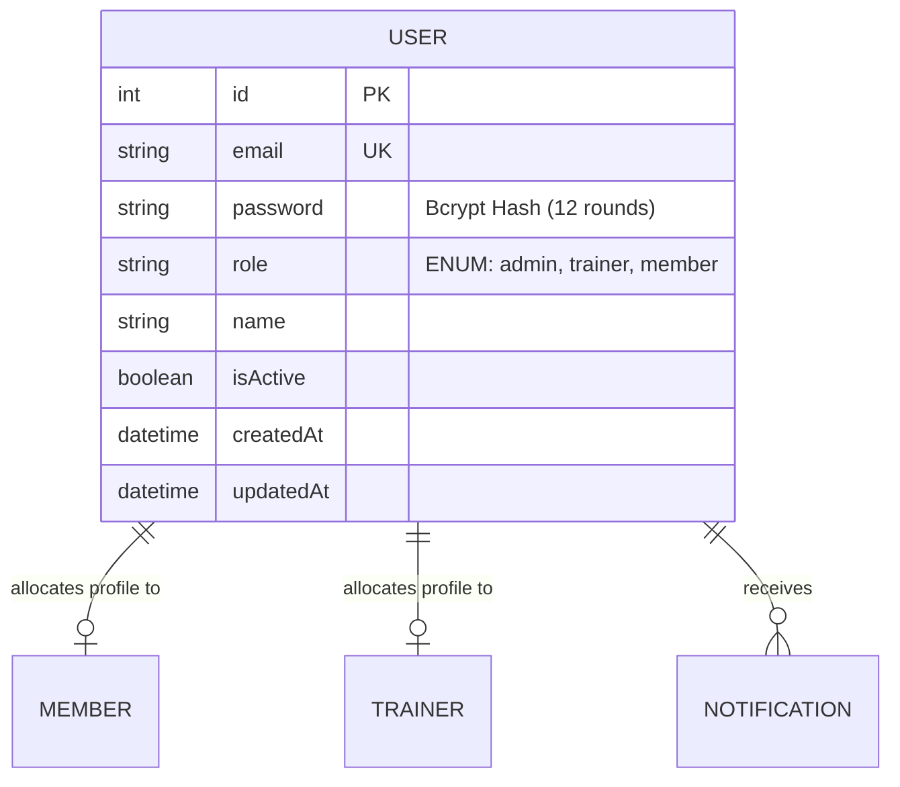
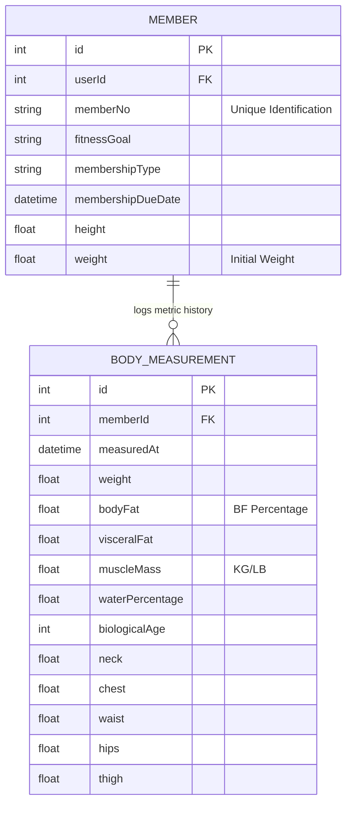
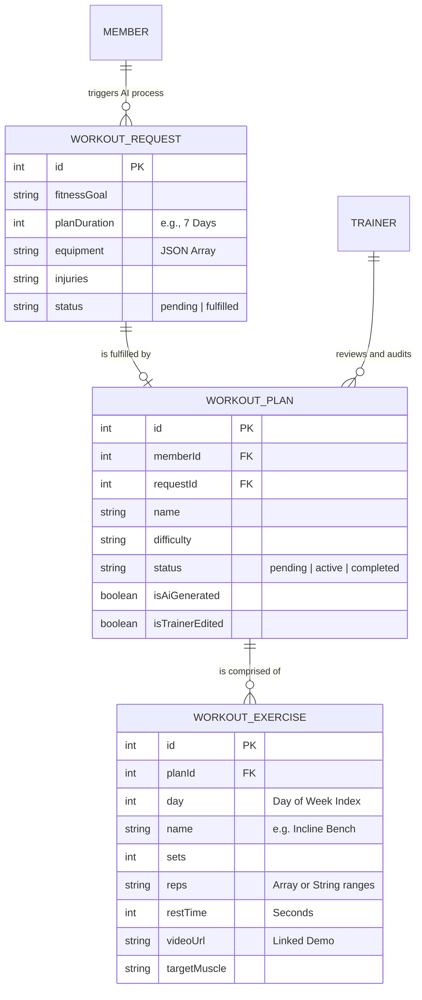
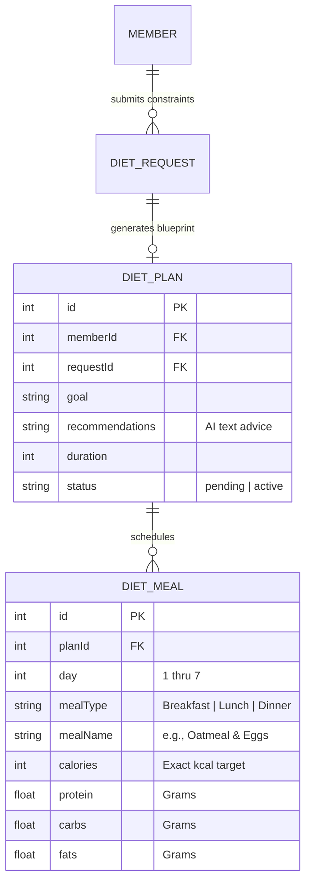
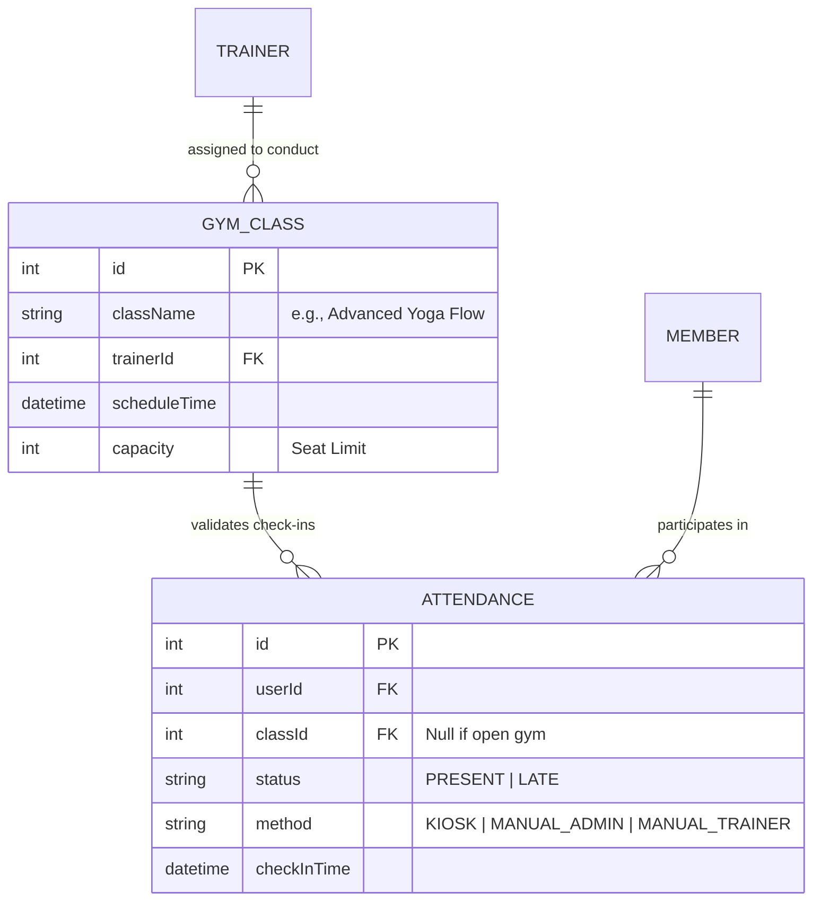
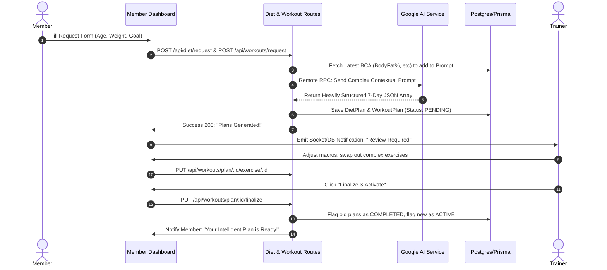
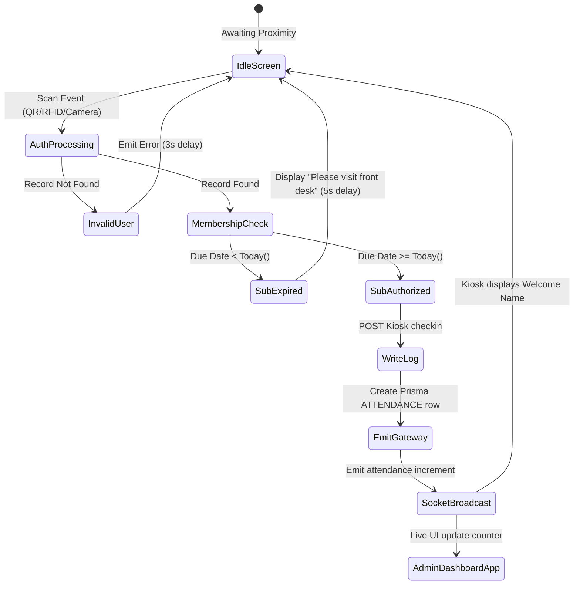
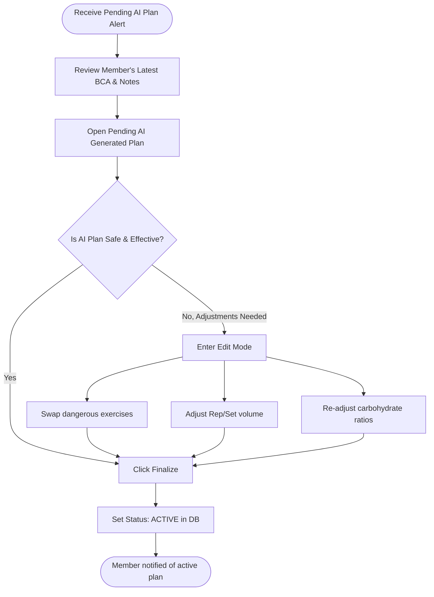

# 🏋️ Atlyss - Ultimate FitCore AI Gym Management Platform

<div align="center">


**The Future of Fitness Management. Intelligent. Real-time. Personal.**

[](https://reactjs.org/)
[](https://nodejs.org/)
[](https://expressjs.com/)
[](https://www.prisma.io/)
[](https://www.postgresql.org/)
[](https://tailwindcss.com/)
[](https://deepmind.google/technologies/gemini/)
[](https://socket.io/)

[🚀 Experience the Live App](https://atlyss-lilac.vercel.app)

</div>

---

## 👥 TEAM MEMBERS

| ID | Name            | Role                |
|----|-----------------|---------------------|
| 01 | Ridham Patel   | Full Stack Developer |
| 02 | Yasar Khan      | Full Stack Developer |
| 03 | Aditya Raulji    | Frontend Developer  |
| 04 | Rijans Patoliya | Backend Developer   |

---

## 📖 Table of Contents

1. [🎯 Executive Summary & Vision](#-executive-summary--vision)
2. [🧠 Key Innovations: AI & Hardware Integration](#-key-innovations-ai--hardware-integration)
3. [✨ Comprehensive Feature Matrix](#-comprehensive-feature-matrix)
   - [🛡️ Admin Dashboard: The Command Center](#-admin-dashboard-the-command-center)
   - [🧘 Trainer Console: The Coaching Hub](#-trainer-console-the-coaching-hub)
   - [🥇 Member Portal: The Personal Journey](#-member-portal-the-personal-journey)
4. [🏗️ Architectural Mastery & Data Flow](#-architectural-mastery--data-flow)
5. [🗄️ Domain-Driven Database Schemas](#-domain-driven-database-schemas)
   - [Identity & Access Control Schema](#1-identity--access-control-schema)
   - [Physical Profiling & BCA Schema](#2-physical-profiling--bca-schema)
   - [AI Workout Generation Schema](#3-ai-workout-generation-schema)
   - [AI Diet Generation Schema](#4-ai-diet-generation-schema)
   - [Facility & Class Management Schema](#5-facility--class-management-schema)
6. [🔄 Detailed User Journey Flowcharts](#-detailed-user-journey-flowcharts)
   - [Member's "Zero to Hero" AI Journey](#workflow-1-the-zero-to-hero-member-journey-sequence)
   - [Smart Kiosk Real-Time Flow](#workflow-2-smart-kiosk-real-time-attendance-state-machine)
   - [Trainer's Plan Review Lifecycle](#workflow-3-trainer-review--approval-lifecycle-flowchart)
7. [📡 Exhaustive API Reference](#-exhaustive-api-reference)
   - [Auth API](#1-authentication-apiauth)
   - [Admin API](#2-admin-management-apiadmin)
   - [Trainer API](#3-trainer-operations-apitrainer)
   - [Member API](#4-member-portal-apimember)
   - [Workout Engine Webhooks](#5-workout-ai-generation-apiworkouts)
   - [Diet Engine Webhooks](#6-diet-ai-generation-apidiet)
8. [📁 Granular Project Structure](#-granular-project-structure)
9. [📥 Deployment & Environment Guide](#-deployment--environment-guide)
10. [🔒 Enterprise-Grade Security Architecture](#-enterprise-grade-security-architecture)
11. [🗺️ Strategic Roadmap](#-strategic-roadmap)
12. [🤝 Contributing & Community](#-contributing--community)
13. [📄 License](#-license)

---

## 🎯 Executive Summary & Vision

**Atlyss** is a next-generation gym management and intelligent coaching ecosystem that redefines the modern fitness experience through the power of **Generative AI** and **Real-time WebSockets**. While traditional gym software focuses solely on administrative ticketing and access control, Atlyss redirects focus toward member progress, providing every user with a "Pocket Personal Trainer" without displacing human coaching.

By intrinsically integrating **Google Gemini 1.5 Pro** layered on top of **Qdrant Vector Databases**, Atlyss creates hyper-personalized workout and diet blueprints that dynamically adapt to the member's evolving Body Composition Analysis (BCA) data. It forms a symbiotic bridge between the operational rigor of gym owners, the specialized coaching requirements of trainers, and the performance goals of individual members.

### Core Problems Solved:
1. **Generic, Static Planning**: Gyms rely on printed, one-size-fits-all sheets. Atlyss generates dynamic JSON structures tailored to specific biological metrics and injuries.
2. **Administrative Overhead**: Atlyss automates routine tasks, from member ID generation (`MEM-YYYY-XXXX`) to real-time capacity management via automated kiosks.
3. **Data Silos in Fitness**: BCA data is often locked in smart scales. Atlyss centralizes visceral fat, muscle mass, and biological age directly into the AI's generation context window.

---

## 🧠 Key Innovations: AI & Hardware Integration

### FitCore AI (Gemini 1.5 Pro)
FitCore AI is the proprietary orchestration engine connecting Prisma data points to LLM prompts. 
It analyzes up to 20 different variables per member (including past injuries, gym equipment availability, and target muscle goals) and returns a heavily structured JSON response containing 7-day workout and diet routines. It mitigates AI hallucination by verifying exercises against an internal vector database.

### Smart Attendance Kiosk Architecture
An unstaffed terminal deployed at the facility entrance. It supports multi-modal identity verification (Camera/QR/RFID abstraction) and instantly communicates with the backend `Socket.io` gateway. The moment a scan occurs, the Kiosk updates the Postgres database and broadcasts an enterprise event, causing live member counters on the Admin Dashboard to tick upward instantly—no browser refresh required.

---

## ✨ Comprehensive Feature Matrix

### 🛡️ Admin Dashboard: The Command Center
The Admin panel is a high-performance workspace designed for franchise operators and facility managers to oversee operations.
- **Dynamic Executive Statistics**: Live charting of active memberships vs. expiring memberships, daily revenue metrics, and peak hour attendance graphs through `Chart.js`.
- **Complete Staff Lifecycle**: Onboard trainers, manage their granular profiles, stipulate their monthly salary or commission structures, and flag accounts as inactive.
- **Enterprise CRM Search**: A dedicated member database view supporting fuzzy search logic to instantly pull up any user's multi-year history.
- **Automated Membership Logic**: Generates strictly formatted `MEM-YYYY-XXXX` identifiers securely on row-creation inside Postgres. It tracks due dates down to the millisecond.
- **Class Pipeline Orchestration**: Create group regimens (e.g., "Advanced HIIT", "Morning Vinyasa Yoga") with hard capacity limits, assign primary trainers, and schedule timeslots.
- **Financial & Retention Auditing**: Calculates total lifetime value (TLV) of membership packages and flags users who are statistically likely to churn based on attendance drops.
- **Attendance Manual Override**: A failsafe interface allowing admins to manually mark members as "PRESENT" or "EXCUSED" if Kiosk hardware fails or a user forgot their credentials.

### 🧘 Trainer Console: The Coaching Hub
Equipping floor staff with AI-augmented tooling and health tracking utilities.
- **Client Roster Management**: A unified inbox showing assigned members. It highlights members who haven't logged a gym session in > 5 days.
- **BCA Specialist Tooling**: Professional entry forms to log >20 health metadata fields, including neck circumference, visceral fat indices, resting metabolism rates, and true biological age vs. chronological age.
- **AI-Augmented Blueprinting**: When a user requests a new plan, the trainer acts as the human-in-the-loop. Trainers receive the AI's 7-day split, and can swap specific exercises (e.g., swapping a Barbell Squat for a Leg Press due to a known knee issue) before clicking "Finalize".
- **Advanced Diet Strategy**: Oversee complex nutritional outputs containing exact protein/carb/fat gram targets per meal, ensuring the AI's caloric recommendation safely aligns with the member's BMI.
- **Session Progress Charts**: Visual graphs mapping the member's body fat percentage reduction against their attendance frequency, empowering trainers to demonstrate their coaching ROI.
- **Personal Scheduling Matrix**: A clean, chronological view of all upcoming group classes the trainer is responsible for conducting.

### 🥇 Member Portal: The Personal Journey
A mobile-optimized, highly engaging interface focused on gamification and fitness tracking.
- **The Daily Dashboard**: Immediate rendering of today's target goals: Active workout routine, aggregate caloric limits, and upcoming booked classes.
- **Interactive Workout Player**: A step-by-step UI to execute the AI/Trainer generated routines. Displays target sets, repetition goals, and rest timers. When an exercise is clicked, a demonstration video or GIF is loaded from an external CDN.
- **Nutrition Command Center**: Breakdown of "Breakfast, Lunch, Dinner, Snack" recommendations, validating if the member hit their macro targets.
- **BCA Growth Curves**: Beautiful, fluid Area Charts visualizing weight history. Members can visibly see the correlation between their gym check-ins and their muscle mass increase over a 6-month period.
- **The "FitCore" Request Engine**: A complex 15-question form allowing members to update the AI of new variables ("I now want to focus on hypertrophy", "I hurt my shoulder and need recovery options").
- **Rating & Accountability System**: Leave 1-to-5 star reviews on assigned trainers, providing management with direct QA feedback.

---

## 🏗️ Architectural Mastery & Data Flow

Atlyss utilizes a decoupled React frontend and Express/Node backend, communicating purely via RESTful JSON APIs and WebSocket protocols for real-time states.



---

## 🗄️ Domain-Driven Database Schemas

The application's data is heavily normalized and managed entirely by Prisma. To understand the complexity, we've broken the main schema down into 5 specific operational domains.

### 1. Identity & Access Control Schema
Handles global user authentication, role assignments, and basic platform identity.



### 2. Physical Profiling & BCA Schema
Records the timeline of a member's transforming physiology based on smart-scale uploads or manual trainer entry.



### 3. AI Workout Generation Schema
Tracks the lifecycle of a workout from initial member request pending AI generation, to trainer modification, to final active deployment.



### 4. AI Diet Generation Schema
Manages complex nutritional constraints, macro calculations, and daily meal planning.



### 5. Facility & Class Management Schema
Oversees the physical orchestration of the gym environment including class capacities and attendance logs.



---

## 🔄 Detailed User Journey Flowcharts

To fully understand Atlyss's complexity, review these step-by-step orchestrations of data passing between UI, Server, and external AI endpoints.

### Workflow 1: The "Zero to Hero" Member Journey (Sequence)
When a user decides they want a newly optimized routine, the system coordinates multiple async events.



### Workflow 2: Smart Kiosk Real-Time Attendance (State Machine)
The hardware-agnostic kiosk operates as an isolated physical state machine resolving rapidly.



### Workflow 3: Trainer Review & Approval Lifecycle (Flowchart)
How a trainer manages the influx of AI plans for their roster.



---

## 📡 Exhaustive API Reference

Our backend utilizes standard JSON REST principles. All protected endpoints (excluding Auth limits) require `Authorization: Bearer <JWT_TOKEN>`.

### 1. Authentication API (`/auth`)
| Method | Endpoint | Description | Security Requirements |
|:-------|:---------|:------------|:----------------------|
| `POST` | `/api/auth/register` | Initialize a new `User` and cascade create `Member` wrapper. | Public |
| `POST` | `/api/auth/login` | Validates Bcrypt hash; issues standard JWT containing ID and Role. | Public |
| `GET`  | `/api/auth/profile` | Fetches full tree structure for logged-in user (including sub-entities). | JWT Guard |

### 2. Admin Management API (`/admin`)
| Method | Endpoint | Description | Expected Payload Format / Result |
|:-------|:---------|:------------|:---------------------------------|
| `GET`  | `/api/admin/stats` | Macro analytics for the main executive admin chart. | Returns `{ count, active, totalRevenue, ... }` |
| `GET`  | `/api/admin/members` | Paginated search of all members supporting query filters. | Query string: `?search=john&limit=20` |
| `POST` | `/api/admin/trainers` | Securely injects new trainer profiles and creates their `User` entry. | JSON `{ name, password, specialization, salary }` |
| `POST` | `/api/admin/classes` | Provisions a new group scheduling slot for a trainer. | JSON `{ className, trainerId, capacity, time }` |
| `PATCH`| `/api/admin/attendance/:id` | Manual override of a kiosk attendance log entry. | JSON `{ status: "EXCUSED" }` |

### 3. Trainer Operations API (`/trainer`)
| Method | Endpoint | Description | Expected Payload Format / Result |
|:-------|:---------|:------------|:---------------------------------|
| `GET`  | `/api/trainer/members` | Returns full roster of `Member`s strictly assigned to this `Trainer`. | Returns `[ { memberId, user.name, ... } ]` |
| `POST` | `/api/trainer/members/:id/measurements`| Trainer submits comprehensive BCA form for specific member. | JSON with 20+ float keys (e.g. `bodyFat: 15.5`) |
| `GET`  | `/api/trainer/profile` | View self trainer metrics and global 1-to-5 star review aggregations. | Returns Trainer schema + Review nested schemas |
| `POST` | `/api/trainer/attendance/bulk` | Force check-in multiple assigned members across a class. | JSON Array of `{ memberId }` |

### 4. Member Portal API (`/member`)
| Method | Endpoint | Description | Expected Payload Format / Result |
|:-------|:---------|:------------|:---------------------------------|
| `PUT`  | `/api/member/profile` | Upsert physical attributes, address, emergency contact data. | JSON mapping to `Member` schema fields. |
| `GET`  | `/api/member/measurements`| Query chronological BCA logs for charting in the UI. | Returns array sorted by `measuredAt DESC` |
| `GET`  | `/api/member/classes`| Fetch a master schedule of all upcoming available slots. | Returns array of `Class` objects with capacities. |
| `POST` | `/api/member/classes/:id/book` | Member reserves a slot, increments class capacity counter. | Return `201 Created` via Prisma. |
| `POST` | `/api/member/review/:t_id` | Leave or update a star rating regarding a specific trainer. | JSON `{ rating, comment }` |

### 5. Workout AI Generation API (`/workouts`)
| Method | Endpoint | Description | Data Handling Logic |
|:-------|:---------|:------------|:--------------------|
| `POST` | `/api/workouts/request` | Client trigger. Constructs the deeply formatted prompt & hits Gemini. | Takes target muscle goals, outputs saved PENDING plan. |
| `GET`  | `/api/workouts/my-plan` | Safe fetch routing for the member app to render the active sequence. | Filters by `status: ACTIVE` where `member.id`. |
| `GET`  | `/api/workouts/pending` | Super-route for trainers to see queue of AI plans awaiting human review. | Returns array of `WorkoutPlan` + embedded user data. |
| `PUT`  | `/api/workouts/plan/:id/exercise/:eid` | Fine-grain modification of AI's choice before finalizing. | Updates single `WorkoutExercise` row. |
| `PUT`  | `/api/workouts/plan/:id/finalize` | Triggers "ACTIVE" state cascade, canceling previous member plans. | Updates `WorkoutPlan`, fires Socket Notification to user. |

### 6. Diet AI Generation API (`/diet`)
| Method | Endpoint | Description | Data Handling Logic |
|:-------|:---------|:------------|:--------------------|
| `POST` | `/api/diet/request` | Client trigger for nutrition. Sends allergies, BMI to Gemini. | Saves a PENDING `DietPlan` with generated meals. |
| `PUT`  | `/api/diet/plan/:id/meal/:mid` | Manual edit of calories, protein, or dish name generated by AI. | Updates single `DietMeal` row. |
| `PUT`  | `/api/diet/plan/:id/finalize` | Trainer stamps plan as biologically safe. Sends live alert. | Transitions `DietPlan` to active, fires webhook. |

---

## 📁 Granular Project Structure

Our massive monorepo is broken effectively into a Vite client and a Node backend. Here is the highly detailed breakdown of responsibility:

### 🖥️ Client (Frontend Node tree)
```bash
client/
├── public/                 # Absolute references, raw uncompiled SVGs and assets
├── src/
│   ├── components/
│   │   ├── attendance/     # Heavy UI maps for Kiosk grids and overrides
│   │   ├── features/       # AI Prompts, rendering engines for workouts/diet
│   │   ├── layout/         # Abstracted SideNavs, Header bars responsive shells
│   │   ├── members/        # Dashboards, data-table grids for user mgmt
│   │   ├── trainers/       # Review components, assignment dropsdowns
│   │   └── ui/             # Our "Shadcn-style" pure reusable components (Buttons, Inputs)
│   ├── context/            # Global React.createContext (AuthContext tracks JWT life)
│   ├── hooks/              # Custom functional hooks (useFetch, useSocket)
│   ├── pages/
│   │   ├── admin/          # Massive routing layer restricting non-admins
│   │   │   ├── AdminDashboard.jsx  # Chart.js initialization
│   │   │   └── MemberMgmt.jsx      # Complex search/filter logic
│   │   ├── trainer/        # Exclusive trainer interfaces
│   │   │   ├── TrainerDashboard.jsx# Inbox view of AI plans
│   │   │   └── BcaTerminal.jsx     # Deep measurement inputs
│   │   ├── member/         # Primary user client interface
│   │   │   ├── MemberDashboard.jsx # Quick stat overview
│   │   │   ├── ActiveWorkout.jsx   # Interactive execution player
│   │   │   └── Progress.jsx        # Area graph generation based on BCA
│   │   ├── AttendanceKiosk/# Specialized fullscreen, low-polling page
│   │   ├── Login.jsx       # Auth router
│   │   └── Register.jsx    # Signup logic + Wizard
│   ├── services/           # Axios interceptors mapping directly to API reference
│   ├── utils/              # Data parsing (formatDate, calcBMI, colorScale)
│   ├── App.jsx             # React-Router DOM v7 logic (ProtectedRoute wrappers)
│   ├── index.css           # Tailwind 4.0 global injection / darkmode css vars
│   └── main.jsx            # React 19 root mount point
```

### ⚙️ Server (Backend Node tree)
```bash
server/
├── prisma/                 # The absolute source of truth for the database
│   ├── migrations/         # Auto-generated SQL diffs for deployment tracking
│   └── schema.prisma       # Defining the 7+ models outlined in the ER section
├── src/
│   ├── controllers/        # Future space for logic extraction from routes
│   ├── data/               # Local JSON Fallback / exercise video mappings
│   ├── lib/                # Third-party integrations & system libraries
│   │   ├── prisma.js       # The singleton PrismaClient connection manager
│   │   ├── gemini.js       # The @google/generative-ai SDK wrapper
│   │   ├── workoutGen.js   # Heavy text prompting logic ensuring JSON compliance
│   │   └── dietGen.js      # Caloric math checking before hitting the LLM
│   ├── middleware/         # Security and abstraction layer
│   │   ├── authMiddleware.js # Extracts JWT from Bearer, decoded payload to req.user
│   │   ├── roleMiddleware.js # Hard stops execution if user.role doesn't match string array
│   │   └── errorHandling.js# Global try/catch interceptor to prevent crash loops
│   ├── routes/             # Exposed express routers (mapped in API Reference)
│   │   ├── auth.js         # Entry node
│   │   ├── admin.js        # Protected: Admin Only operations
│   │   ├── trainer.js      # Protected: Trainer overrides
│   │   ├── member.js       # Protected: End-user manipulations
│   │   ├── workout.js      # Protected: AI specific pipeline
│   │   └── diet.js         # Protected: Nutrition specific pipeline
│   └── index.js            # Express instantiation, CORS setup, and Socket.io binding
├── .env                    # System secrets (ignored by Git)
└── package.json            # Deployment scripts
```

---

## 📥 Deployment & Environment Guide

To get the entire stack operating, you must configure local environments correctly. Atlyss requires multiple active terminals.

### 1. Prerequisites
- **Node.js**: Minimum `v22.x` required to utilize modern V8 engine features.
- **Database**: A running PostgreSQL instance. We recommend Neon.tech or Supabase for local dev.
- **API Keys**: You MUST generate a free API key from [Google AI Studio](https://aistudio.google.com/) for Gemini access.


### 2. Step-by-Step Initialization Sequence
Open Terminal 1 (Database & Backend Engine):
```bash
git clone https://github.com/YASAR300/Atlyss.git
cd Atlyss/server

npm install              # Ingest server dependencies
npx prisma generate      # Compile the strongly-typed Prisma Client
npx prisma db push       # Sync the schema.prisma strictly to PostgreSQL
npm run dev              # Launch Express + Socket.io instance on PORT 5000
```

Open Terminal 2 (Client Application rendering):
```bash
cd Atlyss/client
npm install              # Ingest Vite/React dependencies
npm run dev              # Launch HMR server on PORT 5173
```

### 3. Common Troubleshooting / FAQ
**Q: "Prisma Client Validation Error: Role not found"**
*A: Ensure your PostgreSQL ENUMs matched during `db push`. You may need to manually seed the database using `npx prisma db seed`.*

**Q: "The AI is returning raw text instead of JSON!"**
*A: Update your Gemini prompts in `lib/workoutGen.js` to strictly enforce `JSON` compliance. Sometimes the free tier LLM ignores structural requests under heavy load.*

**Q: "Socket disconnected immediately after login."**
*A: Make sure `VITE_SOCKET_URL` excludes the `/api` sub-path. Socket.io must bind strictly to the root domain origin.*

---

## 🔒 Enterprise-Grade Security Architecture

As a platform handling user health data, biometrics, and facility access, security is not an afterthought in Atlyss.

- 🔑 **Cryptographic Hashing Limits**: Every user password is encrypted strictly via **Bcrypt** utilizing a 12-round mathematical salt generation process protecting against collision attacks.
- 🛡️ **JWT Stateless Ephemerality**: User sessions are tracked via strictly signed JSON Web Tokens avoiding database read overhead. They contain expiry times enforcing re-authentication pipelines.
- 🚦 **Middleware-enforced RBAC**: Every endpoint is protected by a sequence of validations. `verifyToken` checks the signature, followed by `requireRole([roles])` which checks the decoded payload. If a member attempts to hit `/api/admin/stats`, execution is immediately halted with a 403 Forbidden.
- 🧼 **XSS and Injection Mitigation**: Standard SQL injection is rendered impossible through Prisma's parameterized internal query builder. External string inputs on the frontend execute within React's inherent cross-site scripting suppression.
- 📡 **Strict Origin CORS**: The backend refuses any external DOM connection attempts not matching the explicit `CLIENT_URL`.
- 🛑 **Data Leak Prevention**: Nested queries intentionally extract password hashes (e.g. `const { password, ...cleanProfile } = user`) BEFORE piping JSON to the client.

---

## 🗺️ Strategic Roadmap

### Phase 1: Foundation (COMPLETED) ✅
- [x] Establishment of multi-role hierarchy (`Admin` -> `Trainer` -> `Member`).
- [x] Initial integration of Google Gemini providing intelligent Workout/Diet structure.
- [x] Construction of the Smart Kiosk prototype operating over real-time Websockets.
- [x] Exhaustive Body Composition scale mapping (20+ specific input vectors).

### Phase 2: Engagement Dynamics (IN PROGRESS) 👷
- [ ] **Cross-Platform Mobile App**: Porting the React frontend via React Native / Expo to enable members to carry their Active Workout Player without browser navigation.
- [ ] **Integrated QR Provisioning**: The server will generate unique user QR codes dynamically upon registration for instantaneous hardware check-in bypassing face/RFID dependencies.
- [ ] **Stripe Payment Gateway**: Transitioning generic "Membership Price" strings into actual payment webhooks handling recurring subscription renewals.
- [ ] **Data Gamification Leaderboards**: Aggregating member attendance vs BCA improvement metrics to formulate gym-wide rankings.

### Phase 3: Total Intelligence (PLANNED) 🚀
- [ ] **Edge Computer Vision Monitoring**: Integrating `MediaPipe` libraries to the mobile front-end to enable real-time joint tracking, analyzing a member's barbell path and correcting form without trainer intervention.
- [ ] **Predictive Lifetime Churn ML Algorithm**: Processing historic attendance patterns via secondary Python microservices to warn Admins exactly when a member is fundamentally likely to cancel their membership.
- [ ] **B2B Supplement Inventory Hub**: Interlocking dietary AI recommendations with local gym warehouse stock—the app recommends a protein powder that is currently available in the gym lobby.

---

## 🤝 Contributing & Community

Atlyss thrives on collaborative engineering! We welcome developers to help construct the future of gym operations.

### Contribution Pathway
1. **Fork** the master repository to your personal namespace.
2. **Branch Creation**: `git checkout -b feature/EpicNewInnovation`
3. **Commit Standard**: Ensure verbose, declarative commits: `git commit -m 'feat(auth): upgraded Bcrypt to Argon2 hashing'`
4. **Push & Sync**: `git push origin feature/EpicNewInnovation`
5. **Open a PR**: Outline the architecture changes heavily. The maintainers will review promptly!

---

<div align="center">
Built natively with relentless ambition for the Future of Fitness.  
**Platform Authors:**  
**Ridham Patel • Yasar Khan • Aditya Raulji • Rijans Patoliya**  

For support or enterprise deployment inquiries, email: `support@atlyss-systems.io`
</div>
